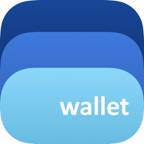

# Workshop del Meetup de Lightning Network: todo lo que siempre quisiste saber

## Primeros pasos: usando una Lightning mobile wallet & webs dónde usar Lightning

Bluwallet es una wallet custodial de Lightning (también podemos guardar BTC pero en este caso sí estamos en posesión de la mnemonic phrase) perfecta para los primeros casos con la Lightning.

De hecho, por eso la elegimos por encima de la Bitcoin Lightning Wallet (más info abajo, en el apartado `Práctica original no realizada`). El workshop se complicaba demasiado con esta última, aparte de encarecerse también.

En las slides adjuntas, de la 39 a la 42, podéis ver los pasos a seguir para las acciones más básicas (mandaros fondos, crear invoice para recibir fondos y pagar invoice para mandarlos). Con sólo esas tres acciones, ya estáis listos para despegar y explorar la Lightning.

Durante el workshop, una vez todos recibieron unos fondos mínimos, se realizó lo que llamamos un `LN Tour`, en el cual visitamos los siguientes websites para ver toda la funcionalidad que la Lightning ya permite, la comodidad y rapidez de los pagos, etcétera.

#### LN Tour. Sitios donde pagar con Lightning:

1) Lightning roulette - https://lightning-roulette.com/

2) Satoshi’s place (global graffiti) - https://satoshis.place/

3) Satoshi tweet (pay for tweet ) - https://satoshitweet.com/

4) Satoshi games - https://satoshis.games/

5) yalls.org - https://yalls.org/

## Práctica original no realizada: Bitcoin Lightning Wallet

1. Nos instalaremos la aplicación Bitcoin Lightning Wallet para realizar nuestros primeros contactos.

Las razones por las que he elegido esta app sobre todas las demás son las siguientes:

    - La conozco, razón importante, porque con tantas app wallets es difícil conocerlas todas.
    - Es non-custodial, es decir, nosotros tenemos el control absoluto sobre todos los fondos que depositemos en ella.
    - Es bastante sencillo conectarnos a nuestro propio nodo de bitcoin (el de LN, usando neutrino, lo levanta la propia app). Esto me parece una característica bastante importante porque nos da todavía más control como usuarios.
    - La interfaz deja mucho que desear, pero tampoco se tarda mucho en despegar.

2. Cada asistente tendrá ya su propio nodo levantado con esta app. Llega la hora de abrirnos canales entre nosotros. Probaremos transacciones directas e indirectas, valiéndonos de los canales ya existentes como puentes.

3. Mostraré la interfaz de DAppNode y mostraré cómo levantando un DAppNode se facilita muchísimo la instalación y mantenimiento de un nodo de Bitcoin y de Lightning. Aunque también tiene sus desventajas en la actualidad.

    Pros: la <b>instalación</b> es tan <b>cómoda</b> como hacer un click. Y cuentas con una <b>interfaz</b> gráfica por defecto donde poder ver todas las métricas de ambos nodos, Bitcoin y Lightning, a la vez que acceso por consola, <b>todo en uno</b>.

    Cons: el gran problema actual de DAppNode es que <b>necesita tener un nodo de Ethereum sincronizado</b> corriendo por debajo. Sin eso no puedes hacer nada.
    Los desarrolladores ya están buscando alternativas (usar directamente IPFS) para poder bordear todos los problemas de implementación que esto supone.
    Yo misma traté de instalar en 3 aparatos distintos DAppNode y no lo conseguí. Ethereum necesita una conexión de Internet muy potente para poder sincronizarse.

<i>Notas:</i> efectivamente, es completamente necesario conectar el nodo de Lightning a uno de Bitcoin, sea de la implementación que sea (la lista de implementaciones la podéis encontrar en las transparencias). Sin conexión a un nodo de Bitcoin o de Litecoin, Lightning es inutilizable.
Espero que después de mi presentación además entendáis por qué esto es así 😉.

4. Hablaré de mi solución para tener mi propio nodo de Lightning, usando los VPS de Contabo y los clientes `bitcoind` y `lnd`, desarrollado por Lightning Labs. 
Si hay tiempo, entraré en más profundidad explicando las configuraciones que ambos nodos requieren y cómo se pueden customizar. 
En el caso del nodo de `bitcoind`, sólo es un archivo, `~/.bitcoin/bitcoin.conf`.
En el caso del nodo de Lightning con `lnd`, existe un archivo principal, que es en el `~/.lnd/lnd.conf`, donde la mayor parte de la 'magia' ocurre.
Pero también existen otros archivos relevantes como son los así llamados `macaroons`, que no son sino un tipo de cookies que usa el `lnd` para verificar las llamadas RPC del `lncli` y comprobar si realmente somos nosotros los que ejecutamos los comandos o es un suplantador que quiere robarnos los fondos.
Todos los archivos `macaroons` se hallan en: `~/.lnd/data/chain/bitcoin/<red-de-bitcoin/`.

Los apunto aquí por orden de más permisos a menos permisos:
    - `admin.macaroon` concede todos los permisos sobre el nodo de LND.
    - `readonly.macaroon`, como su nombre indica, permite hacer sólo peticiones de lectura.
    - `invoice.macarron` sólo tiene acceso a los métodos relacionados con invoices.

<b>IMPORTANT!!</b>: guardad bien vuestros `macaroons`! Cualquiera que se haga con el control de `admin.macaroon` podría robaros vuestros fondos y también paralizar vuestra LApp, en caso de que tengáis una corriendo sobre vuestro nodo.
Para más consejos, el apartado abajo de seguridad.    

<i>Notas:</i> Prácticamente todo lo que se explique en esta parte del workshop la podéis encontrar [en la wiki de la Colmena](https://wiki.colmenalabs.org/): [Guía definitiva de instalación de un nodo LND](https://wiki.colmenalabs.org/lightning-network/6_Gu%C3%ADa_definitiva_para_la_instalaci%C3%B3n_un_nodo_de_LND_y_primeras_interacciones/) y [Configuración y comandos de LND](https://wiki.colmenalabs.org/lightning-network/5_Comandos_para_desplegar_LND/).  

<h3>Seguridad:</h3>

Nunca deberemos guardar más fondos en la Lightning que los que estés dispuesto a llevar en tu cartera. Está pensado para `pocket money`, calderilla. Recuerda que no es una blockchain, por lo tanto para nada tiene el nivel de seguridad de una red establecida como Bitcoin o Ethereum. 

De hecho, hace poco salió [esta noticia](https://messari.io/article/blockstream-developer-finds-lightning-network-security-vulnerabilities), un fallo de seguridad descubierto que afecta a todos los nodos de LND hasta una versión muy reciente. Por eso, tened en cuenta, todos los fondos que guardéis en la Lightnint los podéis perder fácilmente.

<h3>Recursos:</h3>

1. [DAppNode Project](https://dappnode.io/)
2. [DAppNode Installation Guide](https://github.com/dappnode/DAppNode/wiki/DAppNode-Installation-Guide)
3. [bitcoind](https://github.com/bitcoin/bitcoin)
4. [bitcoind.conf - Template](https://github.com/bitcoin/bitcoin/blob/master/contrib/init/bitcoind.conf)
5. [lnd](https://github.com/lightningnetwork/lnd)
6. [Bitcoin Lightning Wallet - App](https://play.google.com/store/apps/details?id=com.lightning.walletapp&hl=en)

## Recursos+: páginas de interés usadas para la presentación</h2>
1. Diagramas para explicar las TXs: https://www.slideshare.net/tm89lee/intro-to-lightning-network-bitcoinlitecoin-blockchain-developers-malaysia
2. Gran fuente para saber qué es el Routing, las Fees, Seguridad dentro de la Lightning...: https://medium.com/suredbits
3. Emulador de funcionamiento de la LN: https://www.robtex.com/lnemulator.html
4. Invoices: https://medium.com/suredbits/lightning-101-what-is-a-lightning-invoice-d527db1a77e6
5. Binance Academy, What is Lightning Network?:  https://www.binance.vision/blockchain/what-is-lightning-network
6. AMPs: https://themoneymongers.com/atomic-multipath-payments/
